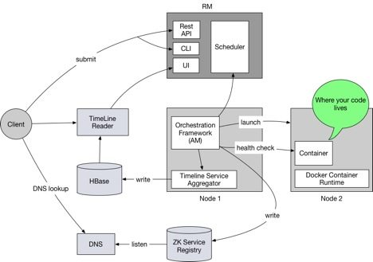

# #1 First-Class Support for Long Running Services on Apache Hadoop YARN

[First-Class Support for Long Running Services on Apache Hadoop YARN - Hortonworks](https://ko.hortonworks.com/blog/first-class-support-long-running-services-apache-hadoop-yarn/)

다음은 위의 북마크의 내용을 번역한 자료이다.

이 글은 하둡 블로그 시리즈 중 첫번째 블로그 글이다. 이 블로그에서는 어떻게 하둡 YARN이 컨테이너 기반의 서비스를 지원하는지를 알 수 있는 고차원적 오버뷰를 제공한다.

Apache Hadoop YARN은 맵리듀스, 하이브/테즈 그리고 스파크와 같은 빅데이터 어플리케이션을 위한 종합 자원 관리 플랫폼으로 잘 알려져 있다. YARN은 복잡한 클러스터 자원 관리와 고차원의 어플리케이션을 스케줄링 하는 것을 추상화하고 그들로 하여금 단독적으로 그 자신만의 특정한 로직에 집중할 수 있게 한다.

빅데이터 앱들뿐만 아니라, 현재 우리가 보고 있는 다른 여러 워크로드들의 넓은 스펙트럼은 HBase, Hive/LLAP 그리고 서비스 기반의 컨테이너(e.g. Docker)와 같이 장기간 운영되는 서비스(long running service)들이다. 

## YARN SERVICE FRAMEWORK COMMING IN APACHE HADOOP 3.1

YARN 서비스 프레임워크라 부르는 이 기능은 2017년 11월에 통합되었다. 종합적으로 33539 라인의 코드 변화를 가진 108개의 커밋으로 이루어졌다. 이 기능은 Apach Hadoop 3.1 릴리즈에서 사용 가능할 것으로 예상된다. 주된 성과들은 다음과 같다.

1. 코어 프레임워크(Application Master)  - YARN에서 실행되어 컨테이너 오케스트레이션을 제공하고, 모든 서비스의 생명주기를 관리하는 책임을 가진다.
2. RESTful API-service - 간단한 JSON 스펙을 사용하여 YARN에서 서비스를 관리하고 배포할 수 있는 API 서비스.
3. YARN DNS 서버 - 표준 DNS lookup으로 YARN의 서비스들을 디스커버리 할 수 있게 하는 YARN 서비스 등록에 지지되는 DNS 서버??
4. 향상된 컨테이너 조정 - 각각의 어플리케이션을 위한 유사성, 비유사성, 컨테이너 리사이징, 노드 레이블을 스케줄링하는 향상된 컨테이너 조정 기능
5. 전체적인 컨테이너나 서비스들을 위한 롤링 업그레이드

또한 YARN 서비스 프레임워크는 YARN의 다른 몇몇의 기능들과도 관련이 있다.

1. YARN에서의 Docker를 위한 First class 지원
2. 라이프사이클 이벤트나 메트릭을 기록하고 유저가 어플리케이션 상세 내역을 쿼리하거나 패치할 수 있도록 하는 풍부한 분석 API를 제공하는 HBase 기반의 네이티브 YARN 타임라인 서비스
3. YARN UI2의 서비스 UI

## EXAMPLE

YARN에서 서비스를 관리하는 복잡성의 대부분은 유저에게 숨겨진다. 유저는 JSON 명세를 이용해서 CLI나 REST API를 통해 YARN에서 실행하는 서비스를 관리하고 배포할 수 있다. 아래의 예제는 httpd 컨테이너를 YARN에 배포하기 위한 JSON 명세이다. 유저는 간단하게 JSON 명세를 REST API로 Post거나 CLI를 사용할 수 있으며 시스템은 그 나머지(컨테이너들이나 컨테이너 오토 리스타트를 해서 어플리케이션의 실행을 유지하거나 하는 다른 액션들을 실행하고 모니터)를 다룬다. 

1. 서비스를 런치하기 위해 아래의 커맨드를 실행하기

      yarn app -launch my-httpd /path/to/httpd.json

      {
      
      	"name": "httpd-service",
      	
      	"lifetime": "3600",
      	
      	"components": [
      	
      		 {
      		
      			   "name": "httpd",
      			
      			   "number_of_containers": 2,
      			
      			   "artifact": {
      			
      				     "id": "centos/httpd-24-centos7:latest",
      				
      				     "type": "DOCKER"
      			
      			   },
      			
      			   "launch_command": "/usr/bin/run-httpd",
      			
      			   "resource": {
      			
      			     "cpus": 1,
      			
      			     "memory": "1024"
      		
      			   }
      	 }]
      	
      }

2. 앱의 상태 확인하기

      yarn app -status my-httpd

3. 컨테이너의 수 늘리기

      yarn app -flex my-httpd -component httpd 3

4. 서비스 멈추기

      yarn app -stop my-httpd

5. 멈춘 서비스 재시작하기

      yarn app -start my-httpd

## UNDER THE HOOD

아래 다이어그램은 장기간 실행되는 서비스들을 지원하는 (full-fledged)YARN을 포함한 주요 컴포넌트들을 나타낸다.

1. 유저는 서비스의 명세를 나타낸 JSON 요청을 YARN Service REST API포스트한다. 그 서비스 명세에는 컨테이너 메모리 사이즈, CPU 코어수, 도커 이미지 ID 등을 포함한다. 이와 비슷하게 YARN CLI를 이용해서도 서비스를 제출할 수 있다.
2. RM은 요청을 받은 이후에 ApplicationMaster를 실행한다.(i.e. 컨테이너 오케스트레이션 프레임워크)
3. 오케스트레이션 프레임워크는 RM으로부터 자원을 요청한다. 이 때 요청하는 자원은 유저가 필요한만큼을 기술한대로이며, 이후에 컨테이너가 할당될 때 NodeManager에서 컨테이너를 실행한다.
4. NodeManager는 컨테이너 프로세스를 실행시키거나 도커 컨테이너 런타임을 사용해서 도커 컨테이너를 실행한다.
5. 오케스트레이션 프레임워크는 컨테이너의 상태를 모니터하고, 컨테이너의 실패 혹은 unhealthiness 상황을 위해 동작한다.
6. Registry DNS 서버는 주키퍼의 znode가 생성되거나 삭제되었을 때를 리스닝하고, A 레코드나 DNS 쿼리를 제공하는 서비스 레코드 등을 생성한다.
7. 각각의 도커 컨테이터에게는 JSON 명세나 YARN 설정에 제공된 정보를 기반으로 유저에게 친숙한 hostname이 주어진다. 클라이언트는 표준 DNS lookup을 사용하여 컨테이너 hostname에 의해 컨테이너의 IP를 lookup 할 수 있다.

## WHAT'S GOOD

어떤 면에서 YARN Service 가 좋은가?

1. 하둡은 그 산업에서 10년이 넘었다. YARN은 하둡 2의 약간 이후 버전에서 등장했지만 충분히 성숙한 프로젝트이며, 거대한 스케일인 실제 프로덕션 환경을 운영중인 수많은 회사들에서 지지를 받아왔다. 추가적으로 YARN 컨테이너 오케스트레이션 프레임워크는 하둡에 존재하는 안정된 기능들 모두에게 영향을 미친다.
2. YARN은 맵리듀스나 스파크와 같은 배치 프로세싱 워크로드들을 아주 잘 지원하는 것으로 증명됐다. 이 기능은 서비스 기반으로 이미 존재하는 컨테이너들을 YARN으로 가져올 수 있는 가능성을 열었다. 이로 인해 유저들은 장기간 실행되는 서비스들이나 배치 프로세싱 잡들을 실행하기 위해 단일 클러스터를 사용할 수 있다. 또한 서로 다른 자원 활용 패턴을 가진 배치 잡이나 서비스들 사이에 자원 공유를 가능하게 한다. 예를 들어, 서비스는 유형적으로 하루종일 자원 활용이 활발하게 실행되지만, 배치 잡들은 밤에만 실행된다. 그러므로 자원 공유는 전체적인 클러스터 활용성을 향상시킨다.
3. 커버로스 보안을 지원하고, 표준 커버로스 보안이 된 하둡 클러스터에도 적합하다.
4. 표준 tar 패키지앱을 지원하고, 도커 containerized app 들도 지원한다.